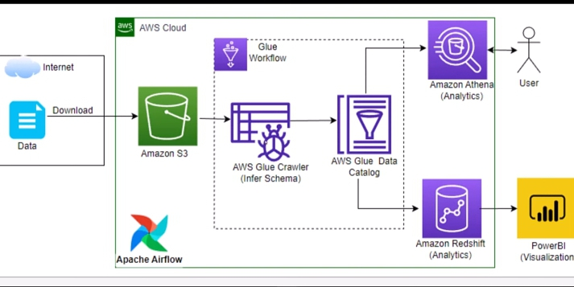

## End-to-End Data Engineering/ETL project on AWS.
(S3, Glue, Glue crawlers, Athena, PowerBI, Redshift Serverless , Airflow, Ec2)

The Orchestration tool used was Airflow which is running on an Ubuntu 22.04 EC2 instance (t2.medium - 2vcpu & 4GB RAM).

The Aim of this project is to build an ETL pipeline which will Extract customer data , Transform the data and make the data available in a Redshift data warehouse, to enable the data to be easily visaulized by end users or Data Analyst

The tools used includes: 
1. AWS S3 for storage
2. Glue Crawlers to crawl both S3 and AWS Redshift table to get the schema
3. Glue Job- To bind the output of the 2 tables from step 2 and Transform the data
4. Amazon Athena for querying our data from the Glue data catalog and analysis
5. Amazon Redshift Serverless for data warehouse
6. PowerBI for Visualization

Keynotes:
- Create a connection from glue to Redshift (Test connection after creation)
- Enable endpoint service in the VPC of the Redshift cluster
(Cluster => serverless dashboard => default-workgroup =>VPC => endpoints => services => search s3 => select first Gateway => select the VPC => select Route tables => click on create endpoint)

- Airflow automates the whole process for us
- Setup aws_s3_conn on the airflow UI
- Install awscli and configure aws
- Connect PowerBI to redshift cluster using the endpoint url, username(admin) and password
- Open 5439 port on the security group of the Redshift Serverless cluster, to enable powerBI to get access

